<table border="0" width="90%" align=center>
  <tr>
    <td width="55%" valign="top" style="border: none;">
      

        <strong><h3>🚀 About Me</h3></strong> 
        <!-- I am a <b>Computer Science student</b> at the <b>University of Wrocław</b> and a <b>Junior Software Engineer</b>. 
        I specialize in building responsive web applications, with professional background in both <b>Angular</b> and <b>React</b> ecosystems.     -->
        

        I am a <b>Junior Software Engineer</b> and CS student at the <b>University of Wrocław</b> with professional experience in building scalable web applications. I specialize in <b>Angular</b> and <b>React</b> ecosystems, with interest in <b>LLMs</b> and <b>Machine Learning</b>.
        

      

      
<strong><h3>🎨 Frontend</h3></strong>

      

        
        
        
        
        
        
        
        <!--  -->
        
      

      
<strong><h3>⚙️ Backend</h3></strong>

      

        
        
        
        
        
      

      
<strong><h3>🧠 AI & Research</h3></strong>

      

        
        
        
      

      <!-- 
<strong><h3>🛃 Version Control</h3></strong>

      

        
        
      
 -->
    </td>
    <td width="full" align="right" valign="middle" style="border: none;">
      
    </td>
  </tr>
</table>

---

### 👀 Featured Projects
A selection of my more interesting work - my engineering thesis, machine learning, and LLM-related projects.

  <table border="0" width="100%">
    <tr>
      <td></td>
      <td></td>
    </tr>
    <tr>
      <td></td>
      <td></td>
    </tr>
  </table>

---

### 🎓 University Coursework (UWR)

Click to expand full course list with references

 

| **Name** | **Description** |
|----------|-----------------|
| **[Analiza Numeryczna](https://github.com/czarekmilek/UWR/tree/main/Analiza%20Numeryczna)** | Coursework and exercises focusing on numerical methods for solving mathematical problems, numerical approximation and error analysis. |
| **[Metody Programowania](https://github.com/czarekmilek/UWR/tree/main/Metody%20Programowania)** | Materials and assignments related to different programming paradigms and methodologies. |
| **[Programowanie Obiektowe](https://github.com/czarekmilek/UWR/tree/main/Programowanie%20Obiektowe)** | Detailed course on Object-Oriented Programming principles and applications. |
| **[Wybrane elementy praktyki projektowania oprogramowania](https://github.com/czarekmilek/UWR/tree/main/Wybrane%20elementy%20praktyki%20projektowania%20oprogramowania)** | Course focused on selected elements of software design practice, covering best practices and methodologies. |
| **[Rachunek Prawdopodobieństwa i Statystyka](https://github.com/czarekmilek/UWR/tree/main/Rachunek%20Prawdopodobie%C5%84stwa%20i%20Statystyka)** | Course materials and exercises related to probability theory and statistics. |
| **[Inżynieria oprogramowania](https://github.com/czarekmilek/UWR/tree/main/In%C5%BCynieria%20Oprogramowania)** | Course focused on software engineering principles, contains documents such as system specifications and conceptual designs. |
| **[Machine Learning](https://github.com/czarekmilek/UWR/tree/main/Machine%20Learning)** | Machine Learning concepts and techniques, focused on topics like data preprocessing, model training and evaluation. |
| **[Kurs: Zaawansowane technologie Javy](https://github.com/czarekmilek/UWR/tree/main/Kurs%20Zaawansowany%20Java)** | Course about Java topics like JavaBeans, RMI, networking and web technologies like servlets and Tomcat. |
| **[Kurs języka Java](https://github.com/czarekmilek/UWR/tree/main/Kurs%20Java)** | Course on fundamentals of Java programming. |
| **[Kurs języka C++](https://github.com/czarekmilek/UWR/tree/main/Kurs%20j%C4%99zyka%20C%2B%2B)** | Course on C++ programming language fundamentals and advanced features. |
| **[Kurs rozszerzony języka Python](https://github.com/czarekmilek/UWR/tree/main/Kurs%20rozszerzony%20j%C4%99zyka%20Python)** | Advanced course on Python. |
| **[Kurs: Tworzenie aplikacji frontendowych](https://github.com/czarekmilek/UWR/tree/main/Kurs%20tworzenia%20aplikacj%20frontendowych)** | Course delving into developing frontend applications, cover basics of frontend development. |
| **[Kurs: React](https://github.com/czarekmilek/UWR/tree/main/Kurs%20React)** | Comprehensive course on React. |
| **[Kurs projektowania aplikacji z bazami danych](https://github.com/czarekmilek/UWR/tree/main/Kurs%20projektowania%20aplikacji%20z%20bazami%20danych)** | Course on database application design, including modeling, querying, and optimization techniques. |

