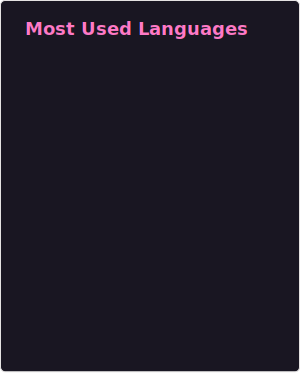
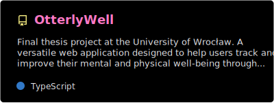
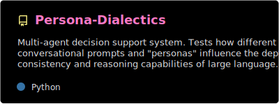
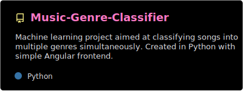
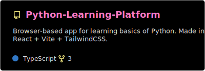

  <h1>Hi, I'm Cezary! 👋</h1>
  
<strong>Junior Software Engineer • Full-Stack Developer • AI & LLM Enthusiast</strong>

  

    
    
  

 

<table border="0" width="100%">
  <tr>
    <td colspan="2" style="border: none;">
      <h3>🚀 About Me</h3>
    </td>
  </tr>
  <tr>
    <td width="55%" valign="top" style="border: none;">
      

      <!-- <blockquote> -->
        
I am a <b>Junior Software Engineer</b> with <b>2+ years of professional experience</b> building responsive, scalable web applications. Specializing in the <b>Angular</b> and <b>React</b> ecosystems, I am also passionate about integrating <b>LLMs</b>, <b>AI agents</b>, and modern backend architectures into production software.

      <!-- </blockquote> -->   
      <h4>📌 Quick Facts</h4>
      <ul style="padding-top: 16px;">
        <li>💼 2+ years crafting modern web applications with React, Angular, and TypeScript.</li>
        <li>🤖 Efficient in building agentic workflows with <b>Python</b>, <b>Spring AI</b>, <b>Model Context Protocol (MCP)</b>, and LLMs.</li>
        <li>🎓 Bachelor of Science in Computer Science from <b>University of Wrocław</b> (UWr).</li>
      </ul>
      <h4>🎯 Current focus</h4>
        <ul style="padding-top: 16px;">
          <li>🚀 Focused on full-stack development, mobile development, and agentic AI systems.</li>
          <li>🌱 Learning <b>Go</b> & <b>React Native & Expo</b>, and <b>AWS</b>.</li>
        </ul>
       
      

        <!-- <blockquote> -->
          <!-- 🟢 <b>Open</b> for <b>Frontend</b>, <b>Full-Stack</b> & <b>AI Roles</b> -->
        <!-- </blockquote> -->
        <!--        -->
        
      

    

    </td>
    <td width="45%" valign="middle" align="center" style="border: none;">
      
    </td>
  </tr>
</table>

 

<table>
  <tr>
    <td colspan="2" style="border: none;">
      <h3>🛠️ Tech Stack & Skills</h3>
    </td>
  </tr>
  <tr>
    <td valign="top" width="50%">
      <h4>🌐 Web Frameworks</h4>
      
      
      
      
      
      
       
      <h4>⚙️ Backend & DB</h4>
      
      
      
      
      
      
       
      <h4>🧠 AI & Machine Learning</h4>
      
      
      
      
      
      
    </td>
    <td valign="top" width="50%">
      <h4>📱 Mobile & Desktop</h4>
      
      
      
       
      <h4>🎨 Styling & UI Design</h4>
      
      
      
      
      
       
      <h4>🧰 Tools & Infrastructure</h4>
      
      
      
      
      
      
    </td>
  </tr>
</table>

 

  <table border="0" width="100%">
    <tr>
      <td colspan="2" style="border: none;">
        <h3>👀 Featured Projects</h3>
      </td>
    </tr>    
    <tr>
      <td width="50%" valign="top" align="center">
        
         
        
        
        
      </td>
      <td width="50%" valign="top" align="center">
        
         
        
        
        
      </td>
    </tr>
    <tr>
      <td width="50%" valign="top" align="center">
        
         
        
        
        
      </td>
      <td width="50%" valign="top" align="center">
        
         
        
        
        
      </td>
    </tr>
  </table>

 

  <table border="0" width="100%">
    <tr>
      <td style="border: none;">
        <h3>🎓 University Coursework & Academic Repositories (UWr)</h3>
        
Academic projects and coursework repositories created during my Computer Science studies at the <b>University of Wrocław</b>:

  <h4>📚 Academic, Full-Stack, AI Projects</h4>
        <ul>
          <li>🎓 <b><a href="https://github.com/czarekmilek/UWR">UWR Repository</a></b> — Solutions, lab assignments, and coursework from CS studies at UWr.</li>
          <li>🦦 <b><a href="https://github.com/czarekmilek/OtterlyWell">OtterlyWell</a></b> — Engineering thesis: React & Supabase app for tracking habits and physical well-being.</li>
          <li>🤖 <b><a href="https://github.com/czarekmilek/Persona-Dialectics">Persona-Dialectics</a></b> — Python project simulating multi-agent LLM debates to evaluate persona-driven reasoning.</li>
          <li>🎵 <b><a href="https://github.com/czarekmilek/Music-Genre-Classifier">Music-Genre-Classifier</a></b> — Machine learning audio classifier in Python with an Angular frontend.</li>
          <li>🎮 <b><a href="https://github.com/czarekmilek/Ben10-Adventure-Text-Game">Ben10-Adventure-Text-Game</a></b> — Java text-based adventure game built for OOP course.</li>
          <li>🥦 <b><a href="https://github.com/czarekmilek/GreenVeggies">GreenVeggies</a></b> — E-commerce online grocery shop built with React and Node.js.</li>
          <li>🔬 <b><a href="https://github.com/czarekmilek/NIFS3">NIFS3</a></b> — Python tool for image reconstruction using cubic spline interpolation.</li>
        </ul>
        <!--   -->
        <h4>🧮 Algorithmic & Low-Level</h4>
        <ul>
          <li>🪙 <b><a href="https://github.com/czarekmilek/Coins-Problem">Coins-Problem</a></b> — C++ solution for the classic coin change problem (Algorithms lab).</li>
          <li>🧮 <b><a href="https://github.com/czarekmilek/Chinese-Cell">Chinese-Cell</a></b> — C++ cellular automaton grid simulation (Algorithms lab).</li>
          <li>🔢 <b><a href="https://github.com/czarekmilek/Numbers-Problem">Numbers-Problem</a></b> — Custom C++ data structure for efficient integer storage and queries (Algorithms lab).</li>
          <li>🌐 <b><a href="https://github.com/czarekmilek/Traceroute">Traceroute</a></b> — C++ network diagnostic tool using raw sockets to trace IP packet routing hops (Computer Networks lab).</li>
        </ul>
    

    </tr>
  </table>

 

  <h3>📫 Let's Connect!</h3>
  
Interested in web development, AI applications, or potential software engineering opportunities?

  

    <a href="mailto:cezarymilek.dev@gmail.com"><strong>📩 Send me an Email</strong></a> • 
    <a href="https://www.linkedin.com/in/cezarymilek/"><strong>💼 Connect on LinkedIn</strong></a>
  

